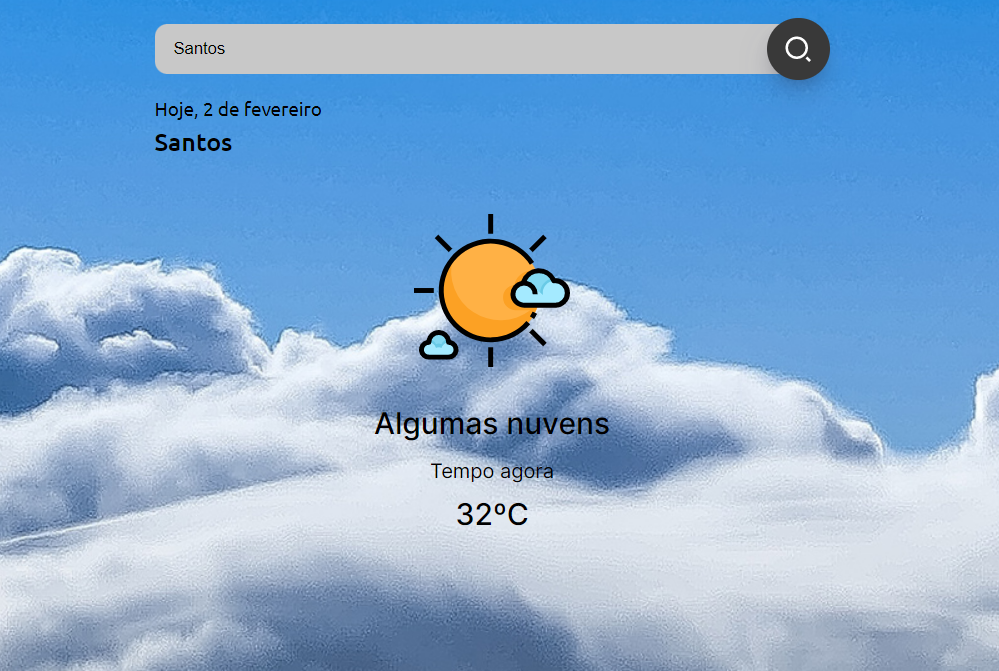
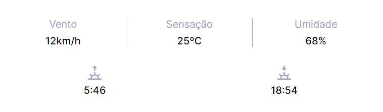

<h1 align="center"><strong>Projeto Snapclima</strong></h1>

Este projeto é o resultado final de um projeto proposto pela imersão FrontEnd PRO com mudanças no código que eu mesmo desenvolvi. Ele consiste em pedir a autorização do usuário para acessar sua localização atual e trazer os dados da cidade do usuário, também podemos acessar através de um campo de busca no qual deve ser inserido o nome da cidade cuja previsão do tempo se deseja consultar. Ao clicar no botão "Buscar" ou na tecla "Enter", o sistema faz uma busca utilizando a API do Open Weather API. Também foram feitas validações no campo de input, caso o usuário busque o nome de uma cidade que não existe, será apresentado uma mensagem de erro. E caso o usuário tente validar o campo de input sem que haja qualquer valor nele, aparecerá uma mensagem de erro mostrando que o campo está vazio.

 

<h2>🌐 Visão Geral do Projeto</h2>

No gif a seguir, uma demonstração do projeto ao fazer uma busca da cidade na qual estou localizado e de algumas outras cidades/estados.

 

<h2>🏙️ Perfil da cidade</h2>

Na primeira seção do resultado de busca, ele nos retorna a data atual e o nome da cidade. Abaixo, ele nos retorna uma foto da previsão do tempo da cidade, nos informando o clima e a temperatura atual em graus celsius.

 

<h2>📱Responsivo</h2>

Versão Mobile

 

<h2>📄 Outras informações</h2>

Na última seção do resultado de busca, a API nos retorna algumas outras informações referentes à cidade que foi pesquisada, como: vento, sensação, umidade, nascer do sol e pôr do sol.

 

<h2>🛠️ Ferramentas Utilizadas</h2>

- HTML5
- CSS3
- JavaScript
- [Open Weather API](https://openweathermap.org/api)

💻 Page do projeto -  [Projeto Snapclima](https://lucas-cassimiro.github.io/snapclima/)

🙋‍♂️ Perfil no LinkedIn - [Lucas Cassimiro](https://www.linkedin.com/in/lucasocassimiro/)